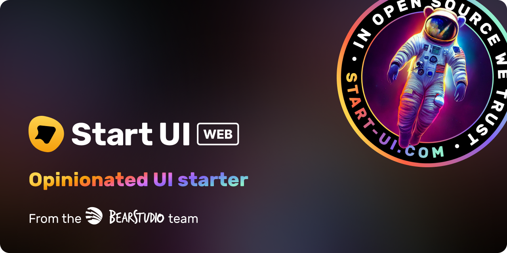
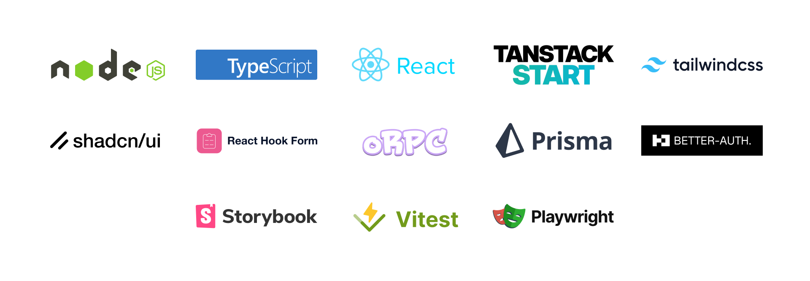

<h1 align="center"></h1>

[](https://go.bearstudio.fr/discord)

🚀 Start UI <small>[web]</small> is an opinionated frontend starter repository created & maintained by the [BearStudio Team](https://www.bearstudio.fr/team) and other contributors.
It represents our team's up-to-date stack that we use when creating web apps for our clients.

## Documentation

For detailed information on how to use this project, please refer to the [documentation](https://docs.web.start-ui.com). The documentation contains all the necessary information on installation, usage, and some guides.

## Demo

A live read-only demonstration of what you will have when starting a project with 🚀 Start UI <small>[web]</small> is available on [demo.start-ui.com](https://demo.start-ui.com).

## Technologies

<div align="center" style="margin: 0 0 16px 0"></div>

[🟦 TypeScript](https://www.typescriptlang.org/), [⚛️ React](https://react.dev/), [⚫️ NextJS](https://nextjs.org/), [⚡️ Chakra UI](https://chakra-ui.com/),  [🟦 tRPC](https://trpc.io/), [▲ Prisma](https://www.prisma.io/), [🏖️ TanStack Query](https://react-query.tanstack.com/), [📕 Storybook](https://storybook.js.org/), [🎭 Playwright](https://playwright.dev/), [📋 React Hook Form](https://react-hook-form.com/)
, [🌍 React i18next](https://react.i18next.com/)


## Requirements

- [NodeJS](https://nodejs.org/) >=20
- [Pnpm](https://pnpm.io/)
- [Docker](https://www.docker.com/) (or a [PostgreSQL](https://www.postgresql.org/) database and an [S3 compatible](https://aws.amazon.com/s3/) service)

## Getting Started

```bash
pnpm create start-ui --web myApp
```

That will scaffold a new folder with the latest version of 🚀 Start UI <small>[web]</small> 🎉

## Installation

1. Duplicate the `.env.example` file to a new `.env` file, and update the environment variables

```bash
cp .env.example .env
```

> [!NOTE]
> **Quick advices for local development**
> - **DON'T update** the **EMAIL_SERVER** variable, because the default value will be used to catch the emails during the development.


2. Install dependencies
```bash
pnpm install
```

3. Setup and start the services (database and S3) with docker
```bash
pnpm dk:init
```

> [!NOTE]
> **Don't want to use docker?**
>
> Setup a PostgreSQL database (locally or online) and replace the **DATABASE_URL** environment variable. Then you can run `pnpm db:push` to update your database schema and then run `pnpm db:seed` to seed your database.
> For S3, Start UI  [web] comes with a Minio service. You can use any online S3 compatible services and update the
> environment variables accordingly.

## Development

```bash
# Run the database in Docker (if not already started)
pnpm dk:start
# Run the development server
pnpm dev
```

### Emails in development

#### Maildev to catch emails

In development, the emails will not be sent and will be catched by [maildev](https://github.com/maildev/maildev).

The maildev UI is available at [0.0.0.0:1080](http://0.0.0.0:1080).

#### Preview emails

Emails templates are built with `react-email` components in the `src/emails` folder.

You can preview an email template at `http://localhost:3000/devtools/email/{template}` where `{template}` is the name of the template file in the `src/emails/templates` folder.

Example: [Login Code](http://localhost:3000/devtools/email/login-code)

##### Email translation preview

Add the language in the preview url like `http://localhost:3000/devtools/email/{template}/{language}` where `{language}` is the language key (`en`, `fr`, ...)

#### Email props preview

You can add search params to the preview url to pass as props to the template.
`http://localhost:3000/devtools/email/{template}/?{propsName}={propsValue}`

### Storybook

```bash
pnpm storybook
```

### Update theme typing

When adding or updating theme components, component variations, sizes, colors and other theme foundations, you can extend the internal theme typings to provide nice autocomplete.

Just run the following command after updating the theme:

```bash
pnpm theme:generate-typing
```

### Generate custom icons components from svg files

Put the custom svg files into the `src/components/Icons/svg-sources` folder and then run the following command:

```bash
pnpm theme:generate-icons
```

> [!WARNING]
> All svg icons should be svg files prefixed by `icon-` (example: `icon-externel-link`) with **24x24px** size, only **one shape** and **filled with `#000` color** (will be replaced by `currentColor`).


### Update color mode storage key

You can update the storage key used to detect the color mode by updating this constant in the `src/theme/config.ts` file:

```tsx
export const COLOR_MODE_STORAGE_KEY = 'start-ui-color-mode'; // Update the key according to your needs
```

### E2E Tests

E2E tests are setup with Playwright.

```sh
pnpm e2e     # Run tests in headless mode, this is the command executed in CI
pnpm e2e:ui  # Open a UI which allow you to run specific tests and see test execution
```

Tests are written in the `e2e` folder; there is also a `e2e/utils` folder which contains some utils to help writing tests.

## Show hint on development environments

Setup the `NEXT_PUBLIC_ENV_NAME` env variable with the name of the environment.

```
NEXT_PUBLIC_ENV_NAME="staging"
NEXT_PUBLIC_ENV_EMOJI="🔬"
NEXT_PUBLIC_ENV_COLOR_SCHEME="teal"
```

## Translations

### Setup the i18n Ally extension

We recommended using the [i18n Ally](https://marketplace.visualstudio.com/items?itemName=lokalise.i18n-ally) plugin for VS Code for translations management.

Create or edit the `.vscode/settings.json` file with the following settings:

```json
{
  "i18n-ally.localesPaths": ["src/locales"],
  "i18n-ally.keystyle": "nested",
  "i18n-ally.enabledFrameworks": ["general", "react", "i18next"],
  "i18n-ally.namespace": true,
  "i18n-ally.defaultNamespace": "common",
  "i18n-ally.extract.autoDetect": true,
  "i18n-ally.keysInUse": ["common.languages.*"]
}
```

## Production

```bash
pnpm install
pnpm storybook:build # Optional: Will expose the Storybook at `/storybook`
pnpm build
pnpm start
```

### Deploy with Docker

1. Build the Docker image (replace `start-ui-web` with your project name)
```
docker build -t start-ui-web .
```

2. Run the Docker image (replace `start-ui-web` with your project name)
```
docker run -p 80:3000 start-ui-web
```
Application will be exposed on port 80 ([http://localhost](http://localhost))
