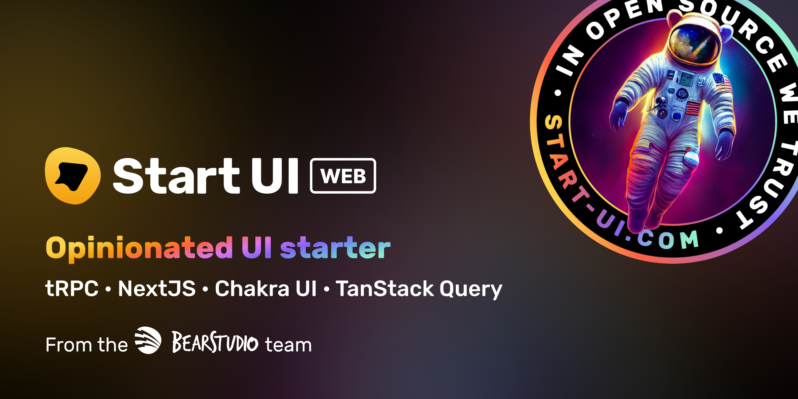

<h1 align="center"></h1>

[](https://go.bearstudio.fr/discord)

🚀 Start UI <small>[web]</small> is an opinionated frontend starter repository created & maintained by the [BearStudio Team](https://www.bearstudio.fr/team) and other contributors.
It represents our team's up-to-date stack that we use when creating web apps for our clients.

## Documentation

For detailed information on how to use this project, please refer to the [documentation](https://docs.web.start-ui.com). The documentation contains all the necessary information on installation, usage, and some guides.

## Demo

A live read-only demonstration of what you will have when starting a project with 🚀 Start UI <small>[web]</small> is available on [demo.start-ui.com](https://demo.start-ui.com).

## Getting Started

```bash
yarn create start-ui --web myApp
```

That will scaffold a new folder with the latest version of 🚀 Start UI <small>[web]</small> 🎉

Then just go to the created folder:

```bash
cd myApp
```

```bash
# Duplicate the .env.example file to a new .env file (update variables)
cp .env.example .env

# Setup and start the db with docker
yarn db:init

# Run the development server
yarn dev
```

## Technology

- 🟦 [TypeScript](https://www.typescriptlang.org/)
- ⚛️ [React](https://reactjs.org/)
- ▲ [NextJS](https://nextjs.org/)
- 📕 [Storybook](https://storybook.js.org/)
- ⚡️ [Chakra UI](https://chakra-ui.com/)
- ⚛️ [TanStack Query](https://react-query.tanstack.com/)
- 🐜 [Formiz](https://formiz-react.com/)
- ⭐️ [React Icons](https://react-icons.github.io/react-icons/)
- 🌍 [React i18next](https://react.i18next.com/)
- 🔽 [React Select](https://react-select.com/)
- 🔢 [React Currency Input Field](https://github.com/cchanxzy/react-currency-input-field)
- 📅 [Day.js](https://day.js.org/)

👉 [Technology Choices](#technology-choices)


## Features

You can find more details about each feature on the [documentation](https://docs.web.start-ui.com)

- Reponsive layout / navigation.
- Sign In / Sign Up / Password recovery screens.
- Account profile / Change Password screens.
- Users management admin screens (CRUD).
- Multi-languages (i18n) (English & French built-in).
- Custom Chakra UI theme with generated typings.
- Great list of UI components with their Storybook documentation.
- Fields components for Formiz.
- Dark mode support with Storybook toggle.
- App version & Environment name in the UI.
- API Schema documentation via [Swagger UI React](https://github.com/swagger-api/swagger-ui).
- API Mocking with a JHipster mapping using Next.js API.
- Developer eXperience improved with ESLint, Prettier and Husky
- Deployment made easy using Next.js

## Installation

1. Duplicate the `.env.example` file to a new `.env` file, and update the environment variables

```bash
cp .env.example .env
```

2. Install dependencies
```bash
yarn install
```

3. Setup and start the db with docker
```bash
yarn db:init
```

## Development

```bash
# Run the development server
yarn dev
```

### Emails in development

#### Maildev to catch emails

In development, the emails will not be sent and will be catched by [maildev](https://github.com/maildev/maildev).

The maildev UI is available at [0.0.0.0:1080](http://0.0.0.0:1080).

#### Preview emails

Emails templates are built with `react-email` components in the `src/emails` folder.

You can preview an email template at `http://localhost:3000/devtools/email/templates/{template}` where `{template}` is the name of the template file in the `src/emails/templates` folder.

Example: [Reset Password](http://localhost:3000/devtools/email/reset-password)

##### Email translation preview

Add the language in the preview url like `http://localhost:3000/devtools/email/{template}/{language}` where `{language}` is the language key (`en`, `fr`, ...)

#### Email props preview

You can add search params to the preview url to pass as props to the template.
`http://localhost:3000/devtools/email/{template}/?{propsName}={propsValue}`

### Storybook

```bash
yarn storybook
```

### Update theme typing

When adding or updating theme components, component variations, sizes, colors and other theme foundations, you can extend the internal theme typings to provide nice autocomplete.

Just run the following command after updating the theme:

```bash
yarn theme:generate-typing
```

### Generate custom icons components from svg files

Put the custom svg files into the `src/components/Icons/svg-sources` folder and then run the following command:

```bash
yarn theme:generate-icons
```

> ⚠️ All svg icons should be svg files prefixed by `icon-` (example: `icon-externel-link`) with **24x24px** size, only **one shape** and **filled with `#000` color** (will be replaced by `currentColor`).


### Update color mode storage key

You can update the storage key used to detect the color mode by updating this constant in the `src/theme/config.ts` file:

```tsx
export const COLOR_MODE_STORAGE_KEY = 'start-ui-color-mode'; // Update the key according to your needs
```

## Show hint on development environments

Setup the `NEXT_PUBLIC_DEV_ENV_NAME` env variable with the name of the environment.

```
NEXT_PUBLIC_DEV_ENV_NAME="staging"
NEXT_PUBLIC_DEV_ENV_COLOR_SCHEME="teal"
```

## Translations

### Setup the i18n Ally extension

We recommended using the [i18n Ally](https://marketplace.visualstudio.com/items?itemName=lokalise.i18n-ally) plugin for VS Code for translations management.

Create or edit the `.vscode/settings.json` file with the following settings:

```json
{
  "i18n-ally.localesPaths": ["src/locales"],
  "i18n-ally.keystyle": "nested",
  "i18n-ally.enabledFrameworks": ["general", "react", "i18next"],
  "i18n-ally.namespace": true,
  "i18n-ally.defaultNamespace": "common",
  "i18n-ally.extract.autoDetect": true,
  "i18n-ally.keysInUse": ["common.languages.*"]
}
```

### Guidelines for translations

- Use namespaces `t('namespace:translationKey')` and nesting `t('namespace:this.is.nested')`.
```js
// Example for translations available in account.json
t('account:data.firstname.label')
```

- For fields and data translations use a `data` object.
```json
// account.json
{
  "data": {
    "firstname": {
      "label": "First Name",
      "required": "First Name is required",
    },
  }
}
```
```js
// React
t('account:data.firstname.label')
t('account:data.firstname.required')
```

- For user feedbacks, use a `feedbacks` object with `actionSuccess` & `actionError` keys containing each `title` and `description` (optional).
```json
// account.json
{
  "resetPassword": {
    "feedbacks": {
      "resetSuccess": {
        "title": "Your password has been reset",
        "description": "You can now login"
      },
      "resetError": {
        "title": "Reset password failed"
      }
    }
  }
}
```
```js
// React
t('account:resetPassword.feedbacks.updateSuccess.title')
t('account:resetPassword.feedbacks.updateSuccess.description')
t('account:resetPassword.feedbacks.updateError.title')
```

- For user actions, use an `actions` object.
```json
// account.json
{
  "resetPassword": {
    "actions": {
      "send": "Send Email",
      "reset": "Reset Password"
    }
  }
}
```
```js
// React
t('account:resetPassword.actions.send')
t('account:resetPassword.actions.reset')
```

- Use the common workspace only for VERY generic translations. By default, use specific namespaces to allow easy update on large code base without unwanted side-effects.

## Production

```bash
yarn install
yarn storybook:build # Optional: Will expose the Storybook at `/storybook`
yarn build
yarn start
```

### Docker

1. Build the Docker image (replace `start-ui-web` with your project name)
```
docker build -t start-ui-web .
```

2. Run the Docker image (replace `start-ui-web` with your project name)
```
docker run -p 80:3000 start-ui-web
```
Application will be exposed on port 80 ([http://localhost](http://localhost))

---

## Technology Choices

### React

[React](https://reactjs.org/) is a JavaScript library created in 2013 to build
reactive user interfaces. At the time of writing, React is probably the front
end library the most used to create new projects and has a huge community which
is beneficial for the maintainability of the project in terms of developers and
online resources.

[GitHub](https://github.com/facebook/react) · [License MIT](https://github.com/facebook/react/blob/master/LICENSE)

### Next.js

Next.js gives you the best developer experience with all the features you need
for production: hybrid static & server rendering, TypeScript support, smart
bundling, route pre-fetching, and more. No config needed.

[GitHub](https://github.com/vercel/next.js) · [License MIT](https://github.com/vercel/next.js/blob/canary/license.md)

### TypeScript

JavaScript is a not typed language. [TypeScript](https://www.typescriptlang.org/)
is here to help add static type definition. TypeScript helps a lot when it comes
to types, interfaces and define contract between functions which helps a lot for
a reliable documentation. No worry, the TypeScript adoption is incremental and
writing in TypeScript is not mandatory to use Start UI, but it is a good
practice to do so to avoid bugs in the future.

[GitHub](https://github.com/microsoft/TypeScript) · [License Apache 2.0](https://github.com/microsoft/TypeScript/blob/master/LICENSE.txt)

### TanStack Query

[TanStack Query](https://github.com/tannerlinsley/react-query) is a powerful tool
to do efficient data synchronization for React. No need of Redux
or another global state manager anymore.
React Query will do the work and is agnostic of the method you will use.

[GitHub](https://github.com/tannerlinsley/react-query) · [License MIT](https://github.com/tannerlinsley/react-query/blob/master/LICENSE)

### Storybook

[Storybook](https://storybook.js.org/) is an Open Source tool to help you
develop framework agnostic components in isolation and document them.

[GitHub](https://github.com/storybookjs/storybook) · [License MIT](https://github.com/storybookjs/storybook/blob/next/LICENSE)

### Chakra UI

[Chakra UI](https://chakra-ui.com/) is a simple, modular, composable and
accessible component library that is highly customizable.

[GitHub](https://github.com/chakra-ui/chakra-ui/) · [License MIT](https://github.com/chakra-ui/chakra-ui/blob/main/LICENSE)

### Formiz

To create React forms, there is a lot of libraries out there.
[Formiz](https://formiz-react.com/) will help you create React forms with ease!
Composable, headless & with built-in multi steps.

[GitHub](https://github.com/ivan-dalmet/formiz) · [License MIT](https://github.com/ivan-dalmet/formiz/blob/master/LICENSE)
