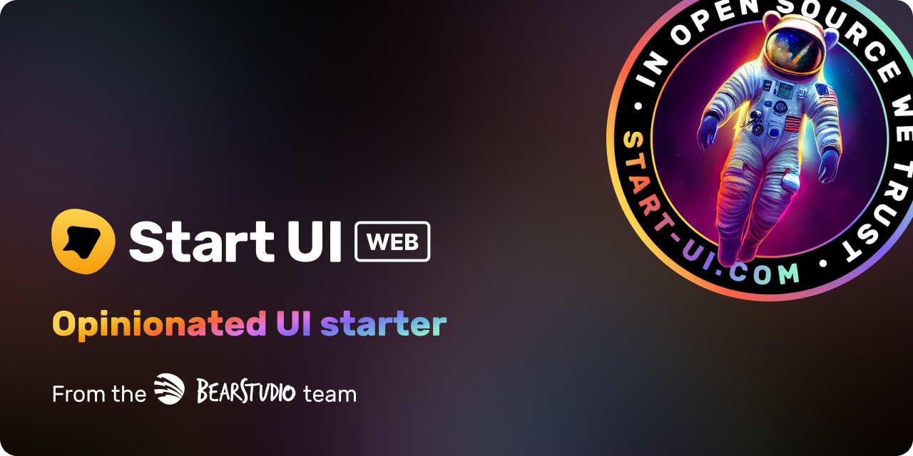
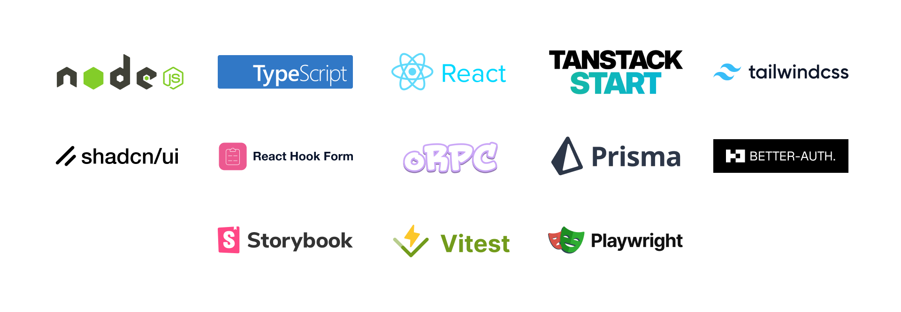

<h1 align="center"></h1>

🚀 Start UI <small>[web]</small> is an opinionated frontend starter repository created & maintained by the [BearStudio Team](https://www.bearstudio.fr/team) and other contributors.
It represents our team's up-to-date stack that we use when creating web apps for our clients.


## Technologies

<div align="center" style="margin: 0 0 16px 0"></div>

[⚙️ Node.js](https://nodejs.org), [🟦 TypeScript](https://www.typescriptlang.org/), [⚛️ React](https://react.dev/), [📦 TanStack Start](https://tanstack.com/start), [💨 Tailwind CSS](https://tailwindcss.com/), [🧩 shadcn/ui](https://ui.shadcn.com/), [📋 React Hook Form](https://react-hook-form.com/), [🔌 oRPC](https://orpc.unnoq.com/), [🛠 Drizzle ORM](https://orm.drizzle.team/), [🔐 Better Auth](https://www.better-auth.com/), [🪐 React Cosmos](https://reactcosmos.org/), [🧪 Vitest](https://vitest.dev/), [🎭 Playwright](https://playwright.dev/)

## Documentation

For detailed information on how to use this project, please refer to the [documentation](https://docs.web.start-ui.com). The documentation contains all the necessary information on installation, usage, and some guides.

## Requirements

* [Node.js](https://nodejs.org) 24.x
* [pnpm](https://pnpm.io/)
* [Docker](https://www.docker.com/) (or a [PostgreSQL](https://www.postgresql.org/) database)

## Getting Started

```bash
pnpm create start-ui -t web myApp
```

That will scaffold a new folder with the latest version of 🚀 Start UI <small>[web]</small> 🎉

## Setup your IDE

- VS Code
```bash
cp .vscode/settings.example.json .vscode/settings.json
```

- Zed
```bash
cp .zed/settings.example.json .zed/settings.json
```

## TypeScript Path Aliases

This project uses Vite's native `resolve.tsconfigPaths: true` option to resolve aliases from `tsconfig.json`. If you need TypeScript path aliases in a Vite 8 project, check the [Vite paths documentation](https://vite.dev/guide/features#paths) before installing an extra plugin.

## Installation

```bash
cp .env.example .env  # Setup your env variables
pnpm install          # Install dependencies
pnpm dk:init          # Start Docker containers (PostgreSQL, MinIO)
pnpm db:init          # Push the Drizzle schema and seed the database
```

> [!NOTE]
> **Don't want to use docker?**
>
> Setup a PostgreSQL database (locally or online) and replace the **DATABASE_URL** environment variable. Then you can run `pnpm db:push` to update your database schema and then run `pnpm db:seed` to seed your database.

## Run

```bash
pnpm dk:start # Only if your Docker containers are not running
pnpm dev
```

## Verification

```bash
pnpm check           # Static checks: format, lint, types, architecture, test layering, security, audit
pnpm test            # Unit, browser, and integration tests
pnpm test:property   # Focused property/invariant tests
pnpm test:e2e        # Full Playwright user journeys
pnpm verify          # Full local pre-merge gate
pnpm verify:task     # Task verification logs; add --visual, --e2e-chromium, or --build as needed
```

`pnpm verify:task` writes timestamped logs under `test-results/task-verification/`. Its optional flags add visual regression tests (`--visual`), Chromium E2E (`--e2e-chromium`), and a production build (`--build`). See [AGENTS.md](AGENTS.md) and [Testing Strategy](TESTING.md) for the full verification workflow.

## Observability

The app uses OpenTelemetry for traces, metrics, and server-emitted logs, with Sentry kept for rich error tracking. Browser telemetry must stay same-origin:

* Browser OTel traces and metrics are exported with OTLP/HTTP protobuf to `/api/telemetry/otel/v1/traces` and `/api/telemetry/otel/v1/metrics`.
* Browser Sentry sends errors only, disables browser tracing, and uses the `/api/telemetry/sentry-tunnel` tunnel.
* Frontend logs are batched to `/api/telemetry/logs`; production source should use `frontendLogger` instead of `console.*`.
* Browser fetch instrumentation only propagates `traceparent` and `baggage` to same-origin requests and ignores `/api/telemetry/*`.
* Server OTel exports directly to `OTEL_COLLECTOR_URL` when configured. Without that env, server export is no-op and local/test proxy summaries can be written to `.telemetry/telemetry.sqlite`.

The telemetry layer derives Query and mutation operation names from static TanStack Query key segments, such as `book.getAll`. Dynamic key values are hashed before becoming attributes; raw dynamic values are only exposed in localhost/debug mode. Route loaders and `beforeLoad` guards are wrapped with route-level spans so navigation time, guard time, loader time, and Query time can be separated.

TanStack Query retry policy is intentionally bounded: queries retry transient/network and 5xx-style failures up to two times, do not retry numeric 4xx client errors, and mutations do not retry by default. Keep query keys aligned with `validateSearch` and `loaderDeps` for routes that read search params.

Optional local Collector:

```bash
docker compose --profile observability up otel-collector
```

The Collector receives OTLP/HTTP on port `4318` and exports to debug, Sentry OTLP, and Honeycomb OTLP exporters using the env vars in `.env.example`. Production browser CSP should not need Sentry, Honeycomb, or Collector origins in `connect-src`; browser traffic goes through the app proxy routes.

TypeScript is configured for ES2024 syntax. The Vite browser build target stays on the evergreen baseline (`baseline-widely-available`) rather than targeting IE-era browsers.

### CodeQL

CodeQL runs in GitHub Actions with the default and `security-extended` query suites plus repo-local queries under `.github/codeql/start-ui-web-queries`. Local CodeQL commands call the CodeQL CLI directly, install the local query pack dependencies first, and require the [CodeQL CLI](https://github.com/github/codeql-cli-binaries/releases) on your `PATH`.

```bash
pnpm codeql:test     # Compile and test local custom queries
pnpm codeql:db       # Create test-results/codeql/start-ui-web-db
pnpm codeql:analyze  # Analyze that DB and write test-results/codeql/start-ui-web.sarif
```

### Emails in development

#### Resend delivery

Emails are sent with [Resend](https://resend.com). Configure `RESEND_API_KEY`
with a Resend API key and set `EMAIL_FROM` to a sender from a verified domain.
Set `RESEND_WEBHOOK_SECRET` to the Resend/Svix signing secret for
`/api/webhooks/resend` delivery status callbacks.
Use `EMAIL_DELIVERY_DISABLED=true` when a workflow should skip delivery, such
as automated end-to-end test runs.

#### Preview emails

Emails templates are built with `react-email` components in the `src/modules/email/presentation` folder.

You can preview an email template at `http://localhost:3000/api/dev/email/{template}` where `{template}` is the name of the template file in the `src/modules/email/presentation/templates` folder.

Example: [Login Code](http://localhost:3000/api/dev/email/login-code)

##### Email translation preview

Add the language in the preview url like `http://localhost:3000/api/dev/email/{template}?language={language}` where `{language}` is the language key (`en`, `fr`, ...)

#### Email props preview

You can add search params to the preview url to pass as props to the template.
`http://localhost:3000/api/dev/email/{template}/?{propsName}={propsValue}`

### OpenAPI Documentation for the API

You can access the API documentation via the OpenAPI interface at:

`http://localhost:3000/api/openapi/app`

This interface allows you to:

* View complete and up-to-date documentation of all backend endpoints exposed by the API.

* Understand request and response formats for each route.

* Facilitate development and debugging by testing endpoints directly from the interface, without needing the frontend.

### Generate custom icons components from svg files

Put the custom svg files into the `src/platform/components/icons/svg-sources` folder and then run the following command:

```bash
pnpm gen:icons
```

If you want to use the same set of custom duotone icons that Start UI is already using, checkout
[Phosphor](https://phosphoricons.com/)

> [!WARNING]
> All svg icons should be svg files prefixed by `icon-` (example: `icon-external-link`) with **square size** and **filled with `#000` color** (will be replaced by `currentColor`).

### E2E Tests

E2E tests are setup with Playwright.

```sh
pnpm e2e:setup  # Setup context to be used across test for more efficient execution 
pnpm e2e        # Run tests in headless mode, this is the command executed in CI
pnpm e2e:ui     # Open a UI which allows you to run specific tests and see test execution
```

> [!WARNING]
> The generated e2e context files contain authentication logic. If you make changes to your local database instance, you should re-run `pnpm e2e:setup`. It will be run automatically in a CI context.
## Production

```bash
pnpm install
pnpm cosmos-export # Optional: Build the React Cosmos component library export
pnpm build
pnpm start
```

## Deploy

This app is a TanStack Start app with Nitro already enabled in `vite.config.ts`. `pnpm build` creates the production `.output` directory, and `pnpm start` runs `.output/server/index.mjs`.

Before deploying anywhere:

* Use Node.js 24 or newer to match the current `package.json` engine.
* Set production values for the required variables in `.env.example`, especially `DATABASE_URL`, `AUTH_SECRET`, `VITE_BASE_URL`, S3 storage, email, OAuth, and any public `VITE_*` values.
* Point `VITE_BASE_URL` at the deployed HTTPS URL. For preview domains, also configure `AUTH_ALLOWED_HOSTS` as needed.
* Run your versioned migration command against the production database before serving production traffic. Do not use `pnpm db:push` for production deployments because it bypasses migration history.

<details>
<summary><strong>Cloudflare Workers</strong></summary>

Cloudflare's TanStack Start guide supports existing projects through Wrangler automatic configuration.

```bash
pnpm dlx wrangler login
pnpm dlx wrangler deploy
```

Wrangler can detect TanStack Start and generate the Worker configuration for `.output/server/index.mjs`, `.output/public`, and the `nodejs_compat` compatibility flag.

For Workers Builds from the Cloudflare dashboard:

* Deploy command: `pnpm dlx wrangler deploy`
* Build variables: set `NODE_VERSION=24` and `PNPM_VERSION=11.1.3`
* Secrets and environment variables: add the production values from `.env.example`

For source-controlled Worker configuration, install Wrangler and the Cloudflare Vite plugin, then follow Cloudflare's existing-app setup for `vite.config.ts` and `wrangler.jsonc`.

```bash
pnpm add -D wrangler @cloudflare/vite-plugin
```

Cloudflare Workers is not a normal Node server, so validate database, storage, and email dependencies with Workers-compatible providers or bindings instead of local Docker, MinIO, and Maildev URLs.

Docs: [Cloudflare TanStack Start](https://developers.cloudflare.com/workers/framework-guides/web-apps/tanstack-start/), [Workers Builds image](https://developers.cloudflare.com/workers/ci-cd/builds/build-image/)

</details>

<details>
<summary><strong>Vercel</strong></summary>

Vercel supports TanStack Start with Nitro, and this repo already has the required `nitro()` Vite plugin.

Deploy from Git:

1. Import the repository in Vercel.
2. Use the TanStack Start preset if it is shown, otherwise use the default project settings.
3. Set Node.js Version to `24.x`.
4. Set Build Command to `pnpm build`.
5. Leave Output Directory empty/default.
6. Add the production environment variables from `.env.example`.
7. Deploy.

Deploy from the CLI:

```bash
pnpm dlx vercel
pnpm dlx vercel --prod
```

For Vercel preview URLs, this app can derive `VITE_BASE_URL` from Vercel's preview environment variables when `VITE_BASE_URL` is not set. Add `AUTH_ALLOWED_HOSTS="*.vercel.app"` if auth should accept Vercel preview hosts.

Docs: [TanStack Start on Vercel](https://vercel.com/docs/frameworks/full-stack/tanstack-start), [Vercel Node.js versions](https://vercel.com/docs/functions/runtimes/node-js/node-js-versions)

</details>

<details>
<summary><strong>Railway</strong></summary>

Railway deploys TanStack Start as a standard Node service. Railpack detects `package.json`, installs pnpm from `packageManager`, runs the `build` script, and uses the `start` script.

Deploy from Git:

1. Create a Railway project and deploy from the GitHub repository.
2. Add a PostgreSQL service or connect an external PostgreSQL database.
3. Add the production environment variables from `.env.example`.
4. Set `RAILPACK_NODE_VERSION=24` if Railway does not pick Node 24 from `package.json`.
5. Generate a public domain in the service Networking tab.
6. Set `VITE_BASE_URL` to that public URL and redeploy.

Deploy from the CLI after installing and authenticating the Railway CLI:

```bash
railway init
railway up
```

If detection fails, set explicit commands in the service settings:

```text
Build Command: pnpm build
Start Command: pnpm start
```

Nitro reads Railway's `PORT` environment variable automatically.

Docs: [Railway TanStack Start](https://docs.railway.com/guides/tanstack-start), [Railway CLI deploys](https://docs.railway.com/cli/deploying), [Railpack Node.js](https://railpack.com/languages/node)

</details>

<details>
<summary><strong>Render</strong></summary>

Render should be configured as a Node Web Service that builds the Nitro output and starts the generated Node server.

Dashboard settings:

```text
Runtime: Node
Build Command: pnpm i --shamefully-hoist && pnpm build
Start Command: node .output/server/index.mjs
```

Environment variables:

```text
NITRO_PRESET=render-com
NODE_VERSION=24
HOST=0.0.0.0
```

Also add the production values from `.env.example`. Render provides `PORT`; Nitro reads `PORT` automatically.

Optional `render.yaml`:

```yaml
services:
  - type: web
    name: start-ui-web
    env: node
    buildCommand: pnpm i --shamefully-hoist && pnpm build
    startCommand: node .output/server/index.mjs
    envVars:
      - key: NITRO_PRESET
        value: render-com
      - key: NODE_VERSION
        value: 24
      - key: HOST
        value: 0.0.0.0
```

Docs: [Nitro on Render](https://nitro-docs.pages.dev/deploy/providers/render/), [Render deploys](https://render.com/docs/deploys), [Render Node.js versions](https://render.com/docs/node-version)

</details>

## Show hint on development environments

Setup the `VITE_ENV_NAME` env variable with the name of the environment.

```
VITE_ENV_NAME="staging"
VITE_ENV_EMOJI="🔬"
VITE_ENV_COLOR="teal"
```

## FAQ

<details><summary><strong>git detect a lot of changes inside my <code>.husky</code> folder</strong></summary>
<p>
You probably have updated your branch with lefthook installed instead of husky. Follow these steps to fix
your hooks issue:
<ul>
  <li><code>git config --unset core.hooksPath</code></li>
  <li><code>rm -rf ./.husky</code></li>
  <li><code>pnpm install</code></li>
</ul>

From now husky should have been removed; and lefthook should run your hooks correctly.
</p>
</details>
