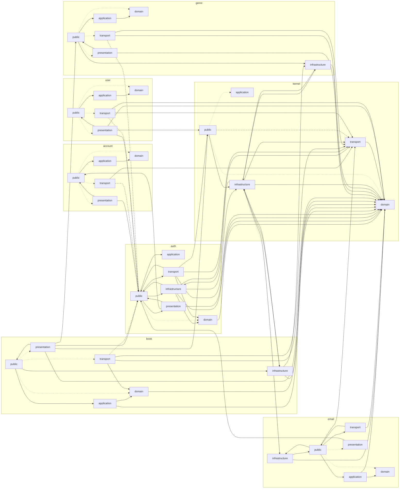

# Module Layer Dependencies

This diagram is generated from dependency-cruiser. Update it with `pnpm architecture:graph`; verify it with `pnpm architecture:graph:check`.

## Edge Styles

- Solid edges are static runtime imports.
- Dashed edges are dynamic imports or type-only dependencies.
- Dotted edges are re-export-only dependencies.
